# OpenLANE-vsd-workshop-Jan2021
The workshop held virtually from 22-26th Jan 2021 through which we learned RTL to GDS2 flow using open source EDA tools. The workshop consisted of theory as well as the lab sessions.

## Table of content
  * 1. Familiarization with tool
  * 2. Working on Openlane
  * 3. Day 1 - How to start with Openlane and synthesis
  * 4. Day 2 - Floorplan and placement
  * 5. Day 3 - Analysis of Inverter using MAGIC and NGSPICE
  * 6. Day 4 - Pre-layout and timing analysis
  * 7. Day 5 - Final steps to RTL2GDSII

# RTL to GDSII using OpenLANE
As OpneLANE is opensource tool that can be installed on any system using a virtual box .To set up OpenLANE in your local PC with virtual box you need :

1. Ubuntu OS
2. Minimum of 25 GB Disk Space
- For installation refer to following git repos: 
1.https://github.com/nickson-jose/openlane_build_script 
2.https://github.com/efabless/openlane 
3.https://github.com/kunalg123/vsdflow

The steps of openlane flow with all required tools are presented hereby:

## The various tools used by OpenLANE in ASIC Flow are :
- #### Synthesis
   - yosys - Performs RTL synthesis
  - abc - Performs technology mapping
  - OpenSTA - Pefroms static timing analysis on the resulting netlist to generate timing reports
- #### Floorplan and PDN
  - init_fp - Defines the core area for the macro as well as the rows (used for placement) and the tracks (used for routing)
  - ioplacer - Places the macro input and output ports
  - pdn - Generates the power distribution network
  - tapcell - Inserts welltap and decap cells in the floorplan
- #### Placement
  - RePLace - Performs global placement
  - Resizer - Performs optional optimizations on the design
  - OpenPhySyn - Performs timing optimizations on the design
  - OpenDP - Perfroms detailed placement to legalize the globally placed components
- #### CTS
  - TritonCTS - Synthesizes the clock distribution network (the clock tree)
- #### Routing 
  - FastRoute - Performs global routing to generate a guide file for the detailed router
  - TritonRoute - Performs detailed routing
  - SPEF-Extractor - Performs SPEF extraction
- #### GDSII Generation
  - Magic - Streams out the final GDSII layout file from the routed def
- #### Checks
  - Magic - Performs DRC Checks & Antenna Checks
  - Netgen - Performs LVS Checks
  
 # Day 1: Familiarization with the opensource platform
- The OpenLANE efabless platform provides a platform to perform the RTL to GDS2 flow using opensource PDK from Google. The pdk folder has all the information and in this project we work on Skywater130. It is a 130nm PDK files. There are three subdirectories that we will be using:
  - Skywater-pdk – Contains all the foundry provided PDK related files, i.e timming libraries, tech files etc
  - Open_pdks – Contains scripts that are used to bridge the gap between closed-source and open-source PDK to EDA tool compatibility, like magic, netgen etc.
  - Sky130A – The open-source compatible PDK files. Inside Sky-130A we have 2 subdirectories: libs.tech and libs.ref
  
#### Working space: openlane_working_dir (open in terminal - cd /work/tools/openlane_working_dir)

#### The libs.tech folder consist of all the tools and libs.ref folder consist the types of foundary files

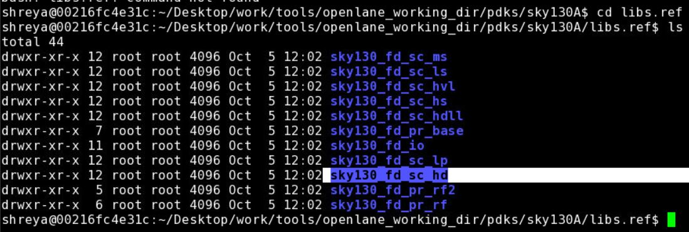
It means Sky PDK foundary, stadard cell, high-density 

## How to invoke OPENLANE
- 1. Get into openlane directory (inside openlane_working_dir, one can see this using command ls -ltr) 
- 2. To invoke openlane, type  ./flow.tcl -interactive
- 3. Now, package needs to be called, type  package require openlane 0.9
- 4. Afterward, prepration of design for the picorv32a take place, type  prep -design picorv32a

- Inside designs folder> picorv32a file is present, to see inside the file, type  less config.tcl

## Synthesis
- The systhesis can be performed in the openlane platform (after design prepration), type  %run_synthesis (it will take few minutes to run)
- Window after systhesis is performed
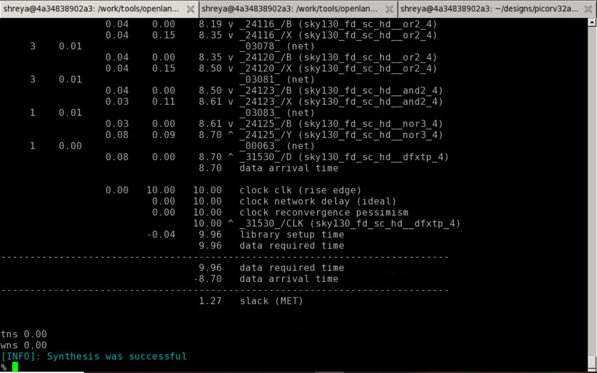

- Yosys and abc are the tools used in the OpenLANE flow for synthesis. it will create a folder by the name of present date in the runs folder, inside which 'results' consist all the details

 # Day 2: Floorplan and Placement
 - One can create own folder as well, in this case instead of creating folder by date_name after run, the runs will occur in the own created folder itself.
 - Command for creating folder during prepration is:
 - % prep -design picorv32a -tag <name> run1
 
 
 ## Floorplan
 - To run floorplan, type   run_floorplan (it will take few minutes to run and afterward the display is as follows)
  
  
  - Floorplan will have several variable, IOplacer can be seen using command  less floorplan.tcl
    
    
   - Now, in order to see the actual floorplan MAGIC (opennsource tool) can be used. For this to open, we will go to folder /results/floorplan
   - Command is   magic -T ~/Desktop/vsdflow/work/tools/openlane_working_dir/pdks/sky130A/libs.tech/magic/sky130A.tech lef read ../../tmp/merged.lef def read picorv32a.floorplan.def &
   
   
   - It opens the floorplan in MAGIC, shown hereby
   
   
   - Now, if we want to see the details of the specific components, first zoom in the structure and put cursor at any specific component and press 's'. It will highlight the specific component. Now, type 'what' in the tkcon window that will give its description.
    
    
 ## Placement
 - Placements are of two types Global and detailed placement
 - The steps are very similar to floorplan, to run type  run_placement
 
 - Command to see the placement in MAGIC is:
 - magic -T /Desktop/vsdflow/work/tools/openlane_working_dir/pdks/sky130A/libs.tech/magic/sky130A.tech lef read ../../tmp/merged.lef def read picorv32a.placement.def &
  
  
  Placement in MAGIC
  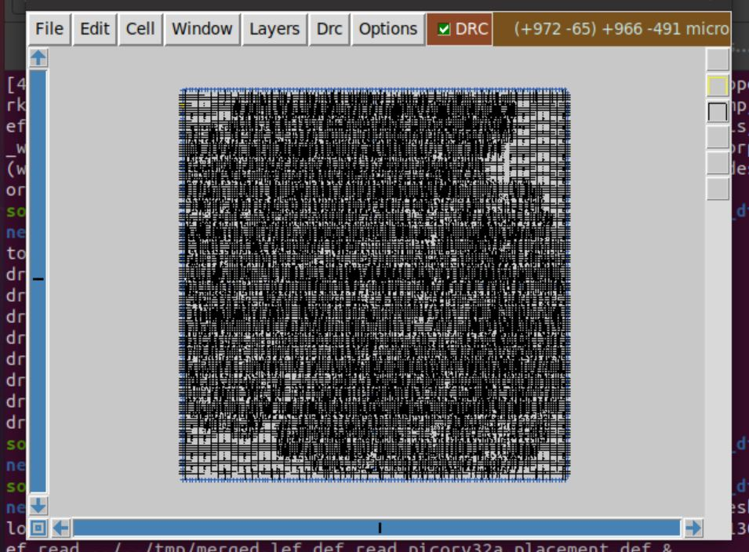
  
  To see specific detail in tkcon using 'what' command
  
  
 
 # Day 3: Analysis of CMOS inverter using MAGIC and NGSPICE
 - We can either create the Inverter layout from scratch or we can just use the precreated inverter layout at https://github.com/nickson-jose/vsdstdcelldesign
 - Steps to create inverter in Openlane
  - 1. Invoke the vsdstdcelldesign to our openlane by using git cloning
  - git clone https://github.com/nickson-jose/vsdstdcelldesign.git
  
  
  - 2. Now, we need to copy the design into /libs.tech/magic. So, first we get into this path and type 
  - cp sky130A.tech ~/Desktop/vsdflow/work/tools/openlane_working_dir/openlane/vsdstdcelldesign
  
  - We can see the copied file
  
  
  ## Inverter in MAGIC
  - Next, we will open the layout in MAGIC, using command
  - magic -T sky130A.tech sky130_inv.mag &
  - Inverter layout in MAGIC
  
  
   - As steps used earlier, we can see the description in tkcon window, also we can check DRC using MAGIC and tkcon windows
   
   
   ## PEX using tkcon
   - To perform parasitic extraction, we use following commands
   
   
   - Files generated can be shown here:
   
   
   - The sky130_inv.spice needs to be edited for our required circuit specifications (editing can be done by opening the spice file in editor)
   
   
   - Now, the spice extracted file will be opened and analysed in ngspice, command    ngspice sky130_inv.spice
   
   
   - Next, to plot the input and output waveform use command   plot y vs time a
   
   
   - Following shows the transient analysis of CMOS inverter
   
   
 #### CMOS inverter delay analysis
  - 1. Fall time - It's the time taken for the signal to go from 80% (i.e. 2.64V) of it's maximum value (i.e. 3.3V) to 20% (i.e. 0.66V). It can be calculated by subtracting the two values of x co-ordinate. The fall time evaluated is 0.01852 ns
   
   
   
   Note: Right click the area in transient analysis waveform window to zoom the area for calculating rise/fall time. Just click on the waveform, it will give the point in the terminal window (as depicted in Figures)
   
  - 2. Rise time - It's the time taken for the signal to go from 20%  to 80%. The rise time evaluated is 0.04364 ns
   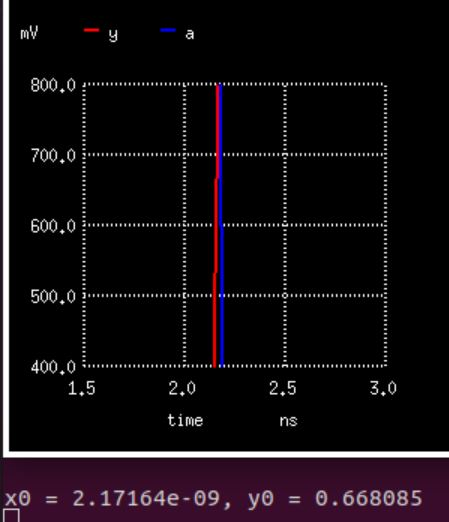
   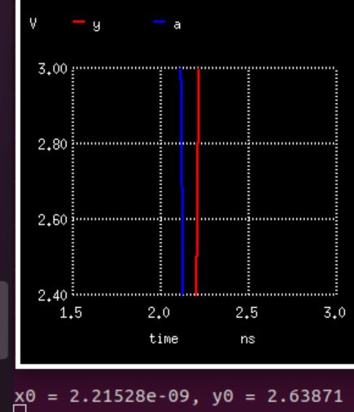
   
   - 3. Propagation delay - It is the difference of input and output waveforms at the 50% of the maximum value. It is calculated as 0.02778 ns.
   
   
 # Day 4: Pre-layout and timing analysis
 - Now, this section will focus on placement and routing step. The PnR tools, make use of abstract LEF files, to perform interconnect optimised routes, in accordance with the set guidelines which have governed the industry. 
 - In the folder, in folder /libs.tech/openlane/sky130_fd_sc_hd$  give command   vim tracks.info
  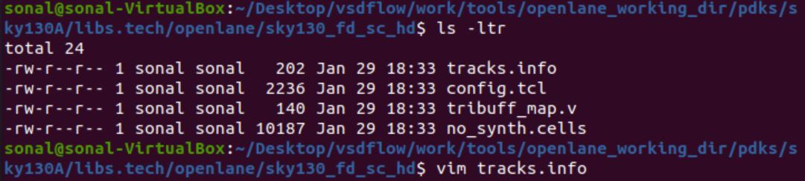
  
  - The track file looks as (this will show the track grids in layout):
  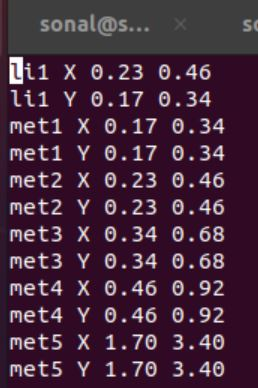
  
  - Although, in our example, the pre-designed Inverter layout is used. However, in case of designing the layout the port names can be defined by selecting the particular port (put cursor there and press 's') and go to edit > text, The MAGIC window will look like:
  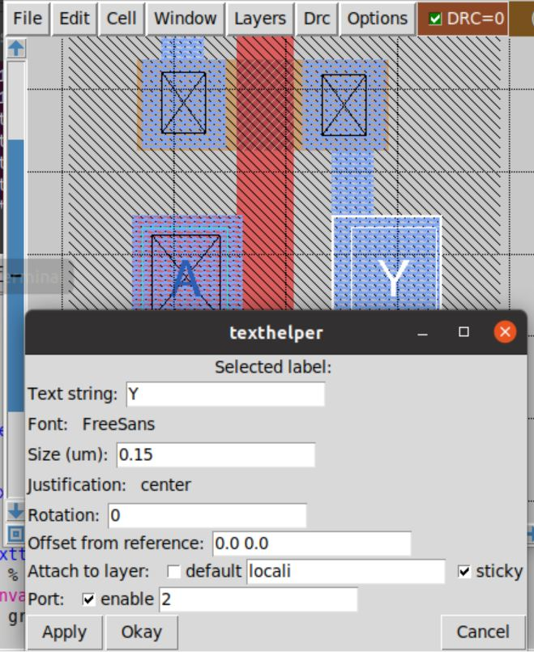
  
  - All the layers description can be seen in the tkcon window
  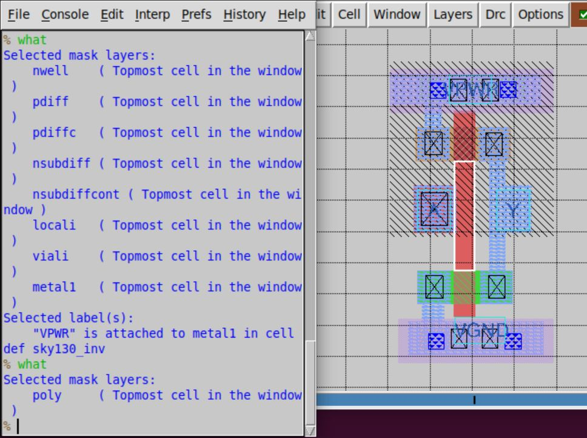
  
  ### How to create lef file
 - Magic tool allows for users to create their Cell LEF file. This returns a scale value of 0.01. In tkcon window type % lef write
  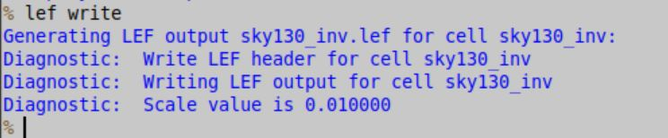
  
  - Now, we can see the lef file generated in vsdstdcelldesign folder as:
  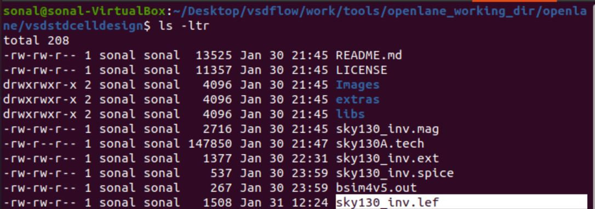
  
  - This is how the lef file will look like (to see lef file, less sky130_inv.lef):
  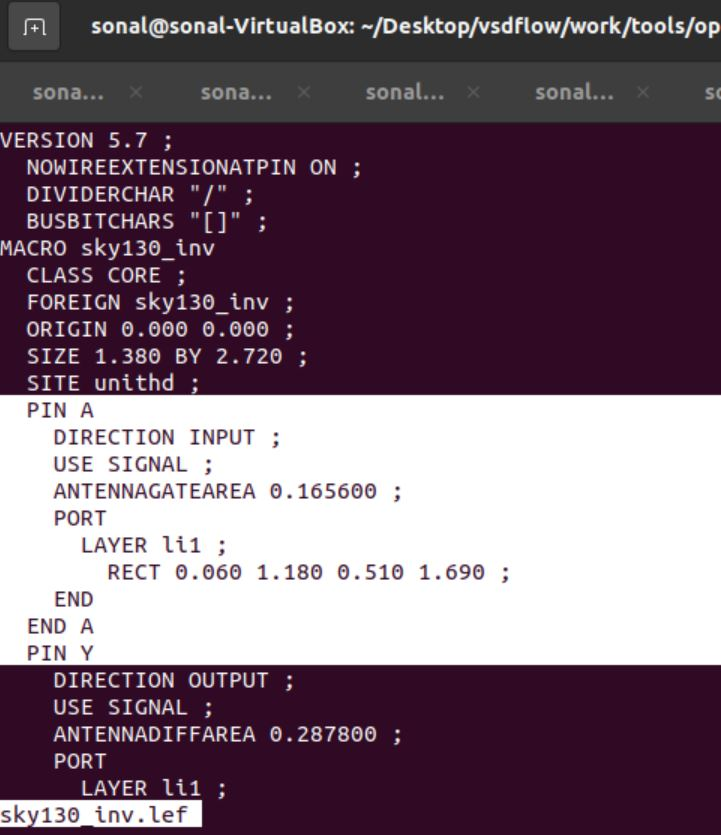
  
  - Next, we will copy the lef file to picorv32a design folder
  - cp sky130_inv.lef ~/Desktop/vsdflow/work/tools/openlane_working_dir/openlane/designs/picorv32a/src
   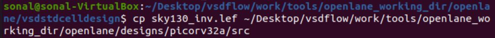
   
   - As we know that any design consist of corners (slow, fast, and typical). Now, these corners flies will also be copied using the command:
   - cp sky130_fd_sc_hd__* ~/Desktop/vsdflow/work/tools/openlane_working_dir/openlane/designs/picorv32a/src
   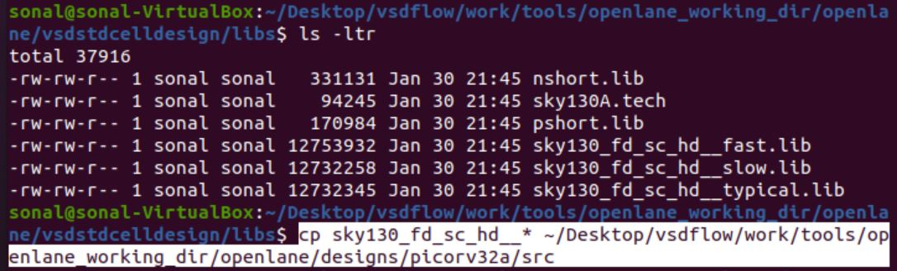
   
   - Check the corner files in ~/picorv32a/src folder
   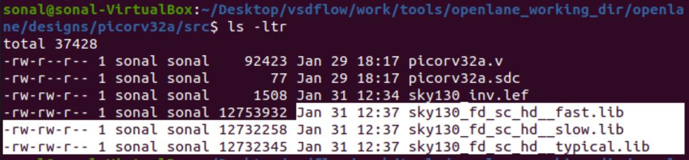
   
  ## How to include standalone standard cell into OpenLANE
  - First, we need to prepare the design in picorv32a with new name in OpenLANE, following the standard steps of invoking OPENLANE
  - ./flow.tcl -interactive 
  - package require openlane 0.9
  
  - Next, the design with new folder will be prepared and it will be overwrote:
  - prep -design picorv32a -tag (name) -overwrtite
  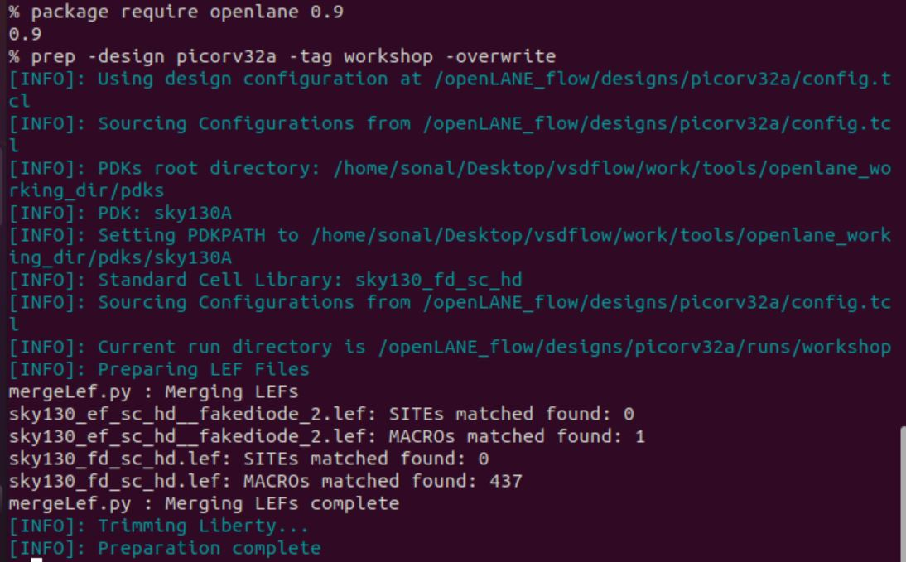
  
  - Now, After add these commands to include sky130_vsdinv.lef in ~/tmp/meged.lef in openlane flow:

   set lefs [glob $::env(DESIGN_DIR)/src/*.lef]
   add_lefs -src $lefs
   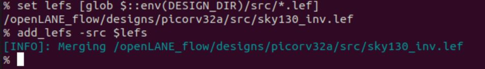
   
   - Now, for this design we will perform all the other steps using pre-descibed commands (run_synthesis, run_floorplan, run_placement)
   - Next, the placement file will be opned in MAGIC using following command:
  -  magic -T /Desktop/vsdflow/work/tools/openlane_working_dir/pdks/sky130A/libs.tech/magic/sky130A.tech lef read ../../tmp/merged.lef def read picorv32a.placement.def &
   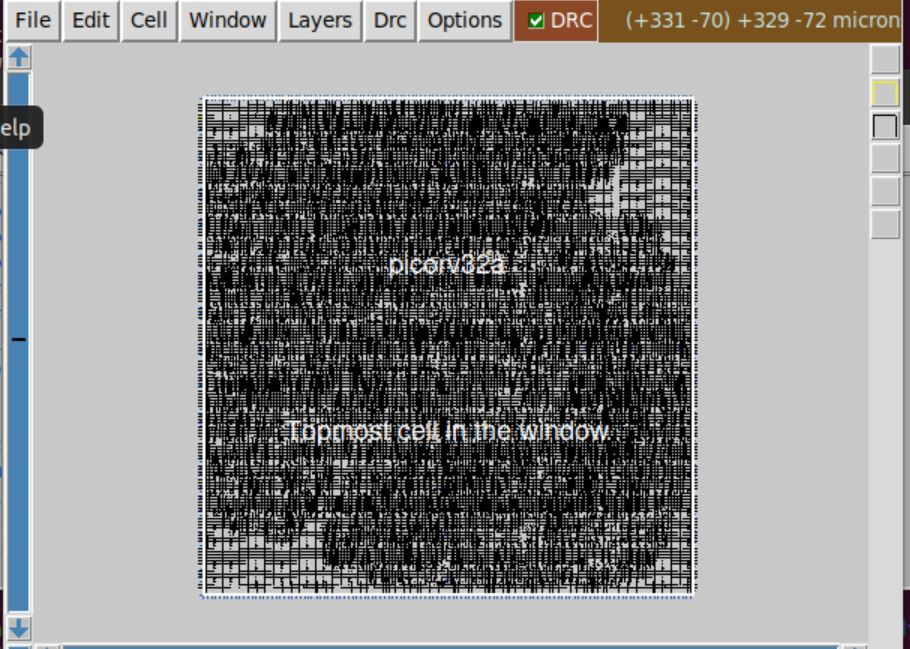
   
   - On zooming the placement of the cell, we can see the standard cells
   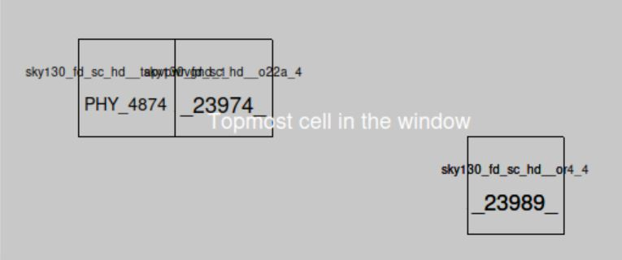
   
   - Now, we need to Copy my_base.sdc to ~picorc32a/src, command
   - cp my_base.sdc ~/Desktop/vsdflow/work/tools/openlane_working_dir/openlane/designs/picorv32a/src
   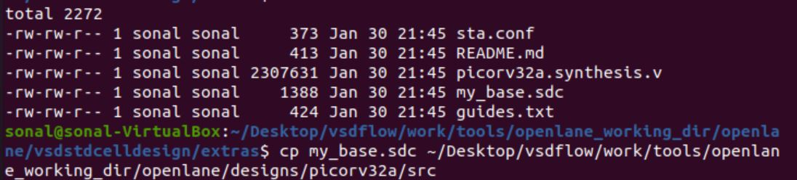
   
   ## Clock tree synthesis
   
   - To run Clock Tress Synthesis in OpenLANE :- % run_cts

- OpenLANE intrinsically will add the necessary buffers required to make sure the timing rules are adhered to which will modify our pre-existing netlist. Buffers are added so that the signal might reach without distortion. This will reflect in the synthesis folder as another file by the name "picorv32a.synthesis_cts.v" along with the traditional "picorv32a.synthesis.v" in the /designs/picorv32a/runs/<tag_name>/results/synthesis directory.

- Note: CTS is run only once synthesis->floorplan->placement has been performed.

- The CTS file looks as follows:
 - 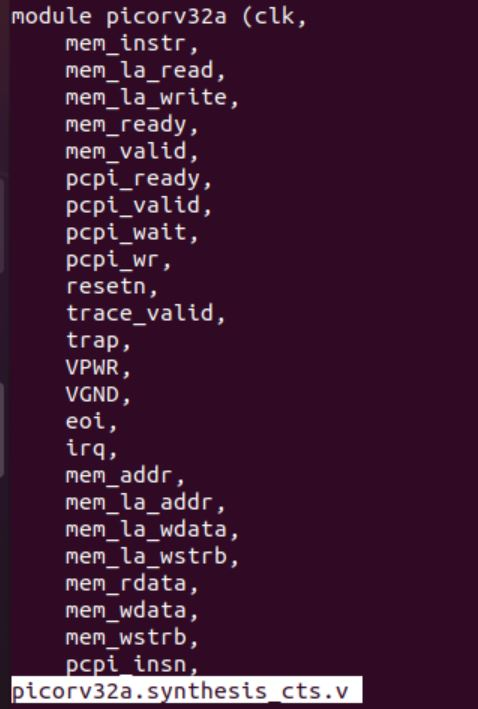
  
  - The CTS can be seen in the MAGIC wherein we can notice the added buffers in the std cell.
  - To open magic, magic -T /Desktop/vsdflow/work/tools/openlane_working_dir/pdks/sky130A/libs.tech/magic/sky130A.tech lef read ../../tmp/merged.lef def read picorv32a.cts.def &
  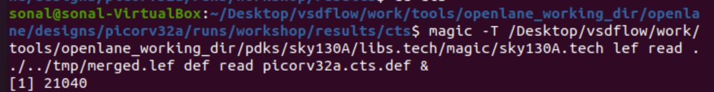
  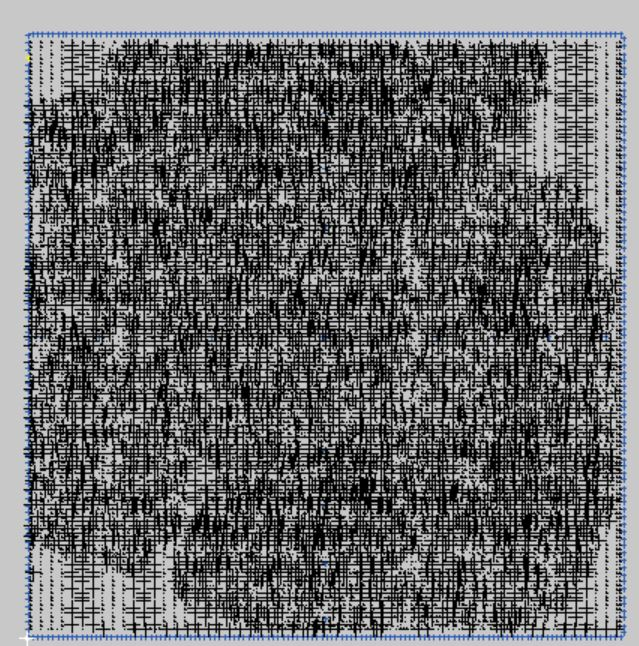
  
  - The buffer circuits can be seen on zooming.
  
  
  ## OpenROAD
 
- Timing analysis is done in OpenLANE by creating a .db database file. This database file is created from the post-cts LEF and DEF files. 
- To invoke OpenROAD use command in OPENLANE,  % openroad.

- Then type the following commands:

- % write_db pico_cts.db
- % read_db pico_cts.db
- % read_lef <Location_of_LEF_file> //Location of LEF file - /designs/picorv32a/runs/<tag_name>/tmp/merged.lef
- % read_def <Location_of_DEF_file> //Location of DEF file - /designs/picorv32a/runs/<tag_name>/results/cts/picorv23a.cts.def
- % read_verilog <Location_of_verilog_file> //Verilog file - /designs/picorv32a/runs/<tag_name>/results/synthesis/picorv32a.synthesis_cts.v 
- % read_liberty $::env(LIB_SYNTH_COMPLETE)
- % link_design <design_name> //design name = picorv32a
- % read_sdc <Location_of_sdc_file> //sdc file - /designs/picorv32a/runs/<tag_name>/src/my_base.sdc
- % set_propagated_clock [all_clocks]
- % report_checks -path_delay min_max -fields {slew trans net cap inpput_pin} -format full_clock_expanded -digits 4 

# Day 5: Final steps 

- At first, to check which part of flow we currently are in use the command (in OPENLANE interactive): % echo $::env(CURRENT_DEF)
- After the CTS when we use the command we see that CURRENT_DEF holds the def file that we get after performing the cts stage.
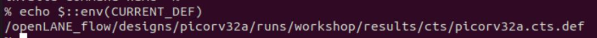

### Power Distribution Netwrok (PDN)
- Next, to perform pdn, use command  % gen_pdn
- We also get an idea about the information regarding Stdcell Rails and Straps. The Standard cell we worked with was the simple inverter which we integrated into the picorv32a design, and we had set the dimensions to be 2.72, the reason of which is explained in the image above. The Standard Cell pitch is defined as 2.72 which indicates that any standard cell is required to fit into multiples of this dimension itself. 
- This image, courtesy of Nickson's tutorial explanation about the Power distribution network, concisely shows how the power is actually distributed to the entire chip.
- 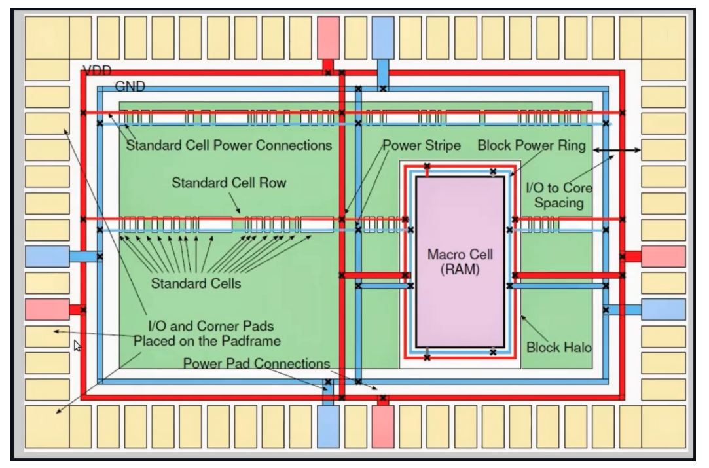

- Here, the green portion represents the design, i.e, picorv32a, the red and blue streaks represent the VCC and GND aspects respectively. As seen, the power and ground parts of the circuit are tapped from their respective ports and vertically distribute themselves to all the necessary points of the design. The Horizontal straps are set aside for the standard cells that we integrate in the design. This is a high level understanding of the power distribution network.

### Routing 
- There are two types of routing : Global and Detailed routing. Global routing is done by FastRoute and Detailed routing is done by TritonRoute. TritonRoute offers us various routing strategis.ROUTING_STRATEGY from 0 to 3 uses Triton-13 engine which has faster runtime and ROUTING_STRATEGY 14 uses Triton-14 engine which has better DRCs. For checking which strategy we are using use the command :

- % echo $::env(ROUTING_STRATEGY)

- Then, routing needs to be performed command,  % run_routing

### SPEF Extraction
- Once the routing is completed, the interconnect parasitics are extracted to perform sign off Post-STA analysis. These parasitics are extracted into a SPEF file.

- The SPEF EXTRACTOR is yet to be integrated to OpenLANE, we have to run it separately. Its available in /work/tools directory. We have to run the python file named main.py in SPEF_EXTRACTOR directory. The command to do this is as folows:

- $ ~/python3 main.py /designs/picorv32a/runs/<tag_name>/tmp/merged.lef /designs/picorv32a/runs/<tag_name>/results/routing/picorv32a.def

   
   

# Contact
Sonal Shreya - shreya.sonal20@gmail.com

 # Acknowledgement
 - Kunal Ghosh - Co-founder (VSD Corp. Pvt. Ltd) https://github.com/kunalg123
 - Nickson Jose - VSD VLSI Engineer https://github.com/nickson-jose
 
